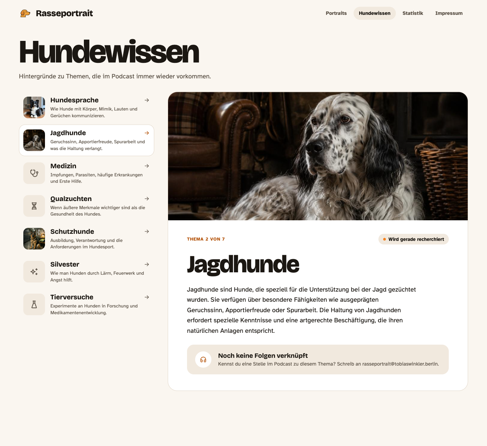
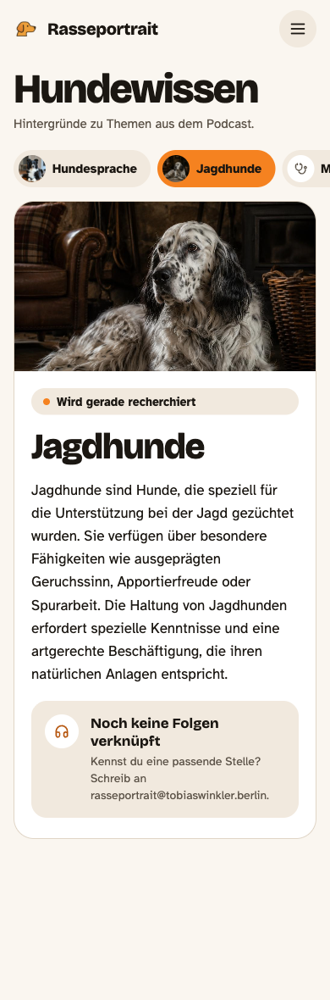

# Change request: topic images on Hundewissen

> **Superseded in part by [hundewissen-themen.md](hundewissen-themen.md):** Hundewissen becomes a topic index with areas → topics → entries. Images now belong to the 12 **areas**, not to topics; the pipeline, sizes, fallback and image brief below still apply with area slugs instead of topic ids (see § 5.4 there). The article banner and topic-list thumbnails of this document are not built.

Follow-up to the Tageslicht redesign (shipped in 3.17.0; the page itself was built from [README.md § Phase 6](README.md#phase-6--hundewissen-hundewissentopic)). Every Hundewissen topic gets its own illustration: a **banner** at the top of the article, a **thumbnail** in the topic list, and a small **round thumbnail** in the mobile topic tabs. Topics without an image yet keep a quiet icon tile, so the page never shows a broken image.

Scope: `types/knowledge.ts`, `db/knowledge/*/index.ts`, `scripts/compileKnowledgeData.cjs`, `scripts/copyIllustrations.cjs`, `package.json` (prebuild order), `app/pages/Hundewissen/*`. No other page changes.

## 1. Target

| Desktop 1440 | Mobile 390 |
|---|---|
|  |  |

Standalone mockups with every measurement: [`mockups/hundewissen-bilder.html`](mockups/hundewissen-bilder.html), [`mockups/hundewissen-bilder-mobil.html`](mockups/hundewissen-bilder-mobil.html). They replace `hundewissen.html` / `hundewissen-mobil.html` as the reference for this page.

**The pictures in the mockups are stand-ins** taken from breed illustrations (English Setter for Jagdhunde, Border Collie for Hundesprache, Deutscher Schäferhund for Schutzhunde). Do not ship them as topic images. Real topic illustrations are produced from the brief in § 6; until a topic has one, it shows the fallback (§ 3.4), as Medizin, Qualzuchten, Silvester and Tierversuche do in the mockup.

## 2. Data and build pipeline

### 2.1 Type

`types/knowledge.ts`:

```ts
export interface KnowledgeImage {
  /** German alt text, one sentence describing the picture (not the topic) */
  alt: string;
  /** CSS object-position for the banner crop, default "50% 50%" */
  position?: string;
}

export interface KnowledgeTopic {
  // …existing fields…
  /** Present when db/knowledge/<id>/illustration.* exists */
  image?: KnowledgeImage;
}
```

In each `db/knowledge/<id>/index.ts` add `image: { alt: "…", position: "…" }` **when** the illustration file is added (alt texts: § 6.3). The compiled JSON gets the resolved paths (below); the TS source only carries alt and position.

### 2.2 Source files

- Put the Midjourney source at `db/knowledge/<id>/illustration.png` (or `.jpg`), next to `index.ts`, like breeds.
- Extend `.gitignore` the same way breeds are handled (sources are large and local only):
  ```
  db/knowledge/**/*.png
  db/knowledge/**/*.jpg
  db/knowledge/**/*.jpeg
  !db/knowledge/**/index.ts
  ```
  The processed files in `public/illustrations/knowledge/` **are** committed, as breed images are.

### 2.3 `scripts/copyIllustrations.cjs`

Add a third pass with its own sizes (topic images are wide, breed images square):

| Output | Size | Crop | Quality |
|---|---|---|---|
| `public/illustrations/knowledge/<id>/illustration.jpeg` | 1600 × 900 | `fit: "cover"`, centre (sharp default) | 75 |
| `public/illustrations/knowledge/<id>/illustration_thumbnail.jpeg` | 400 × 400 | `fit: "cover"`, centre | 75 |

`createWebImage` already takes width/height; give `processImages` a sizes parameter (`{ full: [1600, 900], thumb: [400, 400] }`, defaulting to today's `1000×1000` / `500×500` so breeds and general-purpose images are unchanged).

### 2.4 `scripts/compileKnowledgeData.cjs`

For each topic, check `public/illustrations/knowledge/<id>/illustration.jpeg`:

- File exists and `topic.image.alt` is set → output `image: { src: "illustrations/knowledge/<id>/illustration.jpeg", thumbnail: "illustrations/knowledge/<id>/illustration_thumbnail.jpeg", alt, position }`.
- File exists but no `image.alt` → **fail the build** with `Topic <id> has an illustration but no image.alt` (alt text is required).
- `image` set but no file → warn and **drop** `image` from the output (the UI shows the fallback instead of a broken image).

The compiled type therefore has `src` and `thumbnail`; give the runtime type an extended interface (`KnowledgeImage & { src: string; thumbnail: string }`) or add both fields as optional to `KnowledgeImage`.

### 2.5 Build order

`prebuild` currently runs `build:data && build:knowledge && build:images`. Knowledge now depends on processed images, so change it to:

```json
"prebuild": "npm run build:images && npm run build:data && npm run build:knowledge"
```

## 3. UI (`app/pages/Hundewissen/`)

Image paths are relative to the base path, like breed images (`illustrations/…`); render them the same way the breed pages do. All images `decoding="async"`; list thumbnails `loading="lazy"`; the banner `loading="eager"` (it is the page's largest element).

### 3.1 Article banner

- First child of the `<article>`, **edge to edge**: move the article's padding onto an inner wrapper (`.articleBody`), set `overflow: hidden` on the article so the image takes the card's top corners (radius 28 desktop / 24 mobile).
- ``, `display: block; width: 100%; object-fit: cover; object-position: {image.position ?? "50% 50%"}`.
- `aspect-ratio: 21 / 9` from `md`, `16 / 9` below.
- Body padding below the banner: `40px 56px 48px` from `md` (was `48px 56px` for the whole card), `20px 20px 24px` below.
- No banner when the topic has no image; the article then looks exactly as today (padding back on the card).

### 3.2 Topic list (from `md`)

Each item becomes a two-column grid: `grid-template-columns: 64px minmax(0, 1fr); gap: 16px; align-items: center; padding: 12px` (was `16px 18px`), radius 18 unchanged.

- Left: the thumbnail, 64 × 64, `object-fit: cover`, radius 14, `alt=""` (decorative; the title is the link text).
- Right: the existing title row (title + arrow) and summary, unchanged.
- Active item unchanged (`--rp-surface`, 1px `--rp-line`, orange arrow).

### 3.3 Mobile tabs (below `md`)

- Each pill gets a leading 32 × 32 round thumbnail (`border-radius: 999px; object-fit: cover`, `alt=""`); pill padding becomes `6px 16px 6px 6px`, gap 8, height stays ≥ 44px.
- Active pill: `--rp-accent` with `--rp-on-accent` label, as today.

### 3.4 Fallback (no image)

- List: a 64 × 64 tile, radius 14, `--rp-surface-muted`, with the topic's Tabler icon at 27px in `--rp-text-muted`.
- Mobile tab: a 32px circle in `--rp-surface` (so it shows on the `--rp-surface-muted` pill; on the active orange pill it sits on white) with the icon at 16px.
- Article: no banner.

| Topic | Icon |
|---|---|
| hundesprache | `IconMessages` |
| jagdhunde | `IconTrees` |
| medizin | `IconStethoscope` |
| qualzuchten | `IconDna2` |
| schutzhunde | `IconShieldCheck` |
| silvester | `IconSparkles` |
| tierversuche | `IconFlask` |

Keep the mapping in `app/pages/Hundewissen/topicIcons.ts` with a default (`IconBook`) for future topics.

## 4. Tests (`app/pages/Hundewissen/__tests__/Hundewissen.test.tsx`)

- A topic with `image` renders the banner with its `alt` and `src`, and a list thumbnail with `alt=""`.
- A topic without `image` renders no banner and the icon tile (assert by a `data-testid` on the fallback, e.g. `topic-fallback-<id>`).
- The mobile/desktop list both render one thumbnail or fallback per topic.
- Script-level (optional, if the compile script has tests): missing alt fails, missing file drops `image`.

## 5. Definition of done

1. `npm run typecheck`, `npm test`, `npm run build` pass; `public/data/knowledge.json` contains `image` only for topics whose processed file exists.
2. With no topic images committed, the page looks like the current one plus icon tiles in the list and icon circles in the tabs; no broken images.
3. With one test image (e.g. temporarily a breed illustration under `db/knowledge/jagdhunde/illustration.png`, **not committed**), desktop and mobile match the mockups at 1440 × 900 and 390 × 844.
4. The banner is not a layout shift: `aspect-ratio` reserves the space before the image loads.
5. Alt texts are German and describe the picture.

## 6. Image brief (for Midjourney)

The topic images must look like they belong to the breed illustrations: painterly-realistic, warm, softly lit interiors or landscapes, rich browns and muted greens, shallow depth of field, no text. They are **wide scenes**, not portraits.

### 6.1 Format

- Generate with `--ar 16:9` (the banner crops to 21:9 on desktop, so keep the subject in the middle 80% vertically and away from the top and bottom edges).
- The thumbnail is a centre square: keep the main subject centred horizontally.
- Minimum 1600 × 900 source; PNG or JPEG.
- Style suffix used for every prompt (tune to match the breed set, then keep it fixed):
  `painterly realistic illustration, warm natural window light, cozy rustic setting, muted earthy palette, soft depth of field, high detail, no text, no watermark --ar 16:9 --style raw`

### 6.2 Prompts

Sensitive topics (Qualzuchten, Tierversuche) are shown symbolically and calmly: no suffering, no injured or distressed animals, no identifiable real breed singled out as a victim.

| Topic | Prompt (prepend to the style suffix) | Suggested `position` |
|---|---|---|
| Hundesprache | two dogs of different breeds meeting on a sunlit meadow path, relaxed body language, one with a play bow, tails loose, gentle mutual curiosity | `50% 55%` |
| Jagdhunde | a pointing dog standing in classic point at the edge of a misty autumn field at dawn, reeds and golden grass, a wooden hunting stand in the distance | `50% 45%` |
| Medizin | a calm dog sitting on a wooden examination table in a warm, old-fashioned country vet practice, a stethoscope and glass jars on the shelf, a caring hand resting on the dog's back | `50% 40%` |
| Qualzuchten | a thoughtful still life: an old breeding register book, a magnifying glass and a vintage dog-show ribbon on a wooden desk, a healthy mixed-breed dog resting in soft focus in the background | `50% 50%` |
| Schutzhunde | a focused working dog walking at heel beside its handler on a training field in evening light, calm and controlled, leash loose | `50% 45%` |
| Silvester | a relaxed dog curled up in a cozy blanket den under a table in a warmly lit living room on New Year's Eve, faint fireworks glow through a curtained window, a person reading nearby | `50% 60%` |
| Tierversuche | an empty, softly lit laboratory bench with glassware and notebooks at dusk, seen through a window; outside, a happy dog sits in a garden in warm evening light | `50% 50%` |

### 6.3 Alt texts (set together with the image)

Describe what is in the final picture; adjust if the generated image differs.

| Topic | `image.alt` |
|---|---|
| hundesprache | Zwei Hunde begegnen sich auf einem sonnigen Wiesenweg, einer lädt mit einer Spielverbeugung ein. |
| jagdhunde | Ein Vorstehhund steht im Morgennebel am Rand eines herbstlichen Feldes. |
| medizin | Ein ruhiger Hund sitzt auf dem Behandlungstisch einer gemütlichen Tierarztpraxis. |
| qualzuchten | Ein altes Zuchtbuch, eine Lupe und eine Ausstellungsschleife auf einem Holztisch, dahinter ein ruhender Hund. |
| schutzhunde | Ein konzentrierter Arbeitshund geht bei Fuß neben seiner Hundeführerin über einen Übungsplatz. |
| silvester | Ein entspannter Hund liegt in einer Deckenhöhle unter dem Tisch, draußen leuchtet Feuerwerk. |
| tierversuche | Ein leerer Labortisch in der Dämmerung, draußen sitzt ein Hund im Garten. |

## 7. Rollout

Ship the code first (all topics fall back to icons, nothing visible breaks). Then add images one topic at a time: drop the source into `db/knowledge/<id>/`, set `image` in `index.ts`, run `npm run build:images && npm run build:knowledge`, commit the processed JPEGs and the JSON (`feat: illustration for Hundewissen <Thema>`).
