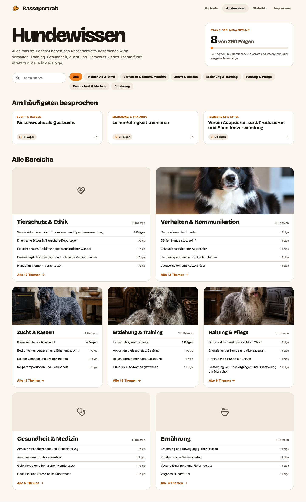
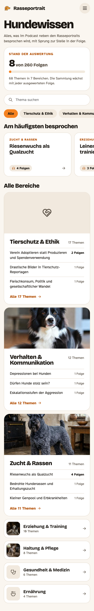
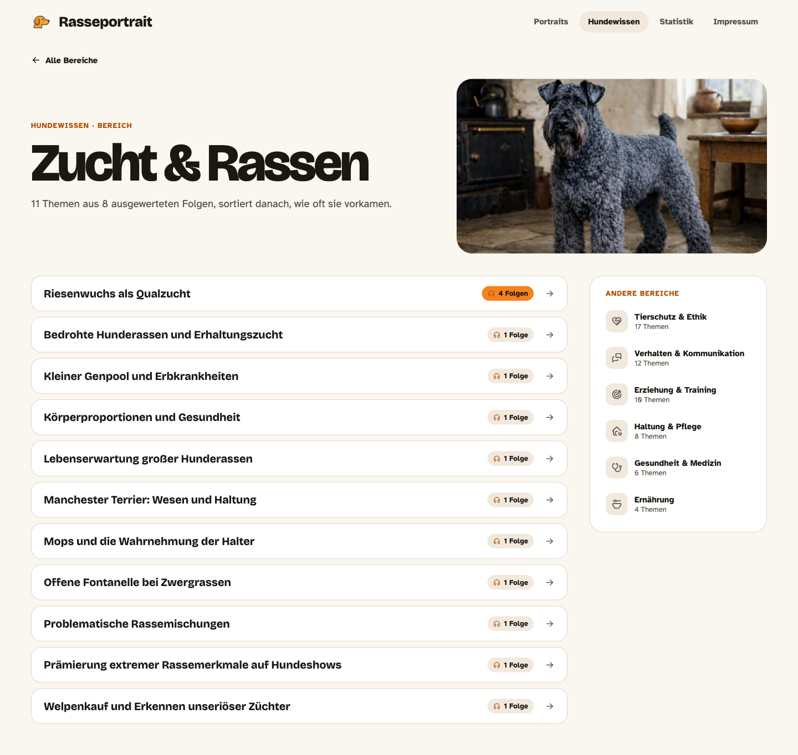
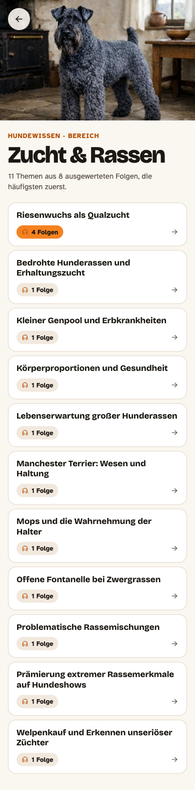
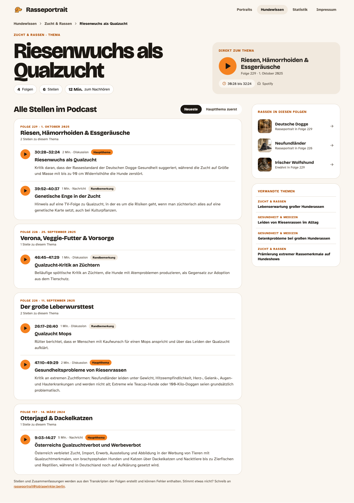
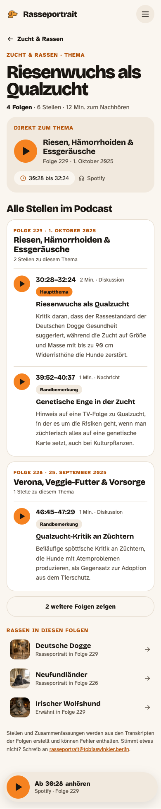

# Hundewissen as a podcast topic index — implementation handover

Hundewissen changes from seven hand-written articles into an index of **everything the podcast discusses besides the breed portraits**, generated from transcripts by `scripts/podcast_index`: **areas** (Bereiche) → **topics** (Themen) → **entries** (Stellen: an episode plus a time range). Every entry can be played from its timecode, like the breed pages.

This document covers both sides: what the pipeline has to add to its output (§ 4), and how the site compiles and renders it (§ 5–8). It supersedes Phase 6 of [README.md](README.md) and replaces the per-topic images of [hundewissen-bilder.md](hundewissen-bilder.md) with per-**area** images (§ 5.4). Design tokens, components and copy rules of the main handover still apply.

---

## 1. Target screens

| Page | Desktop 1440 | Mobile 390 |
|---|---|---|
| Overview `/hundewissen` |  |  |
| Area `/hundewissen/zucht-rassen` |  |  |
| Topic `/hundewissen/zucht-rassen/qualzuchten` |  |  |

Standalone mockups with every measurement: `mockups/hundewissen-bereiche.html`, `…-bereiche-mobil.html`, `…-bereich.html`, `…-bereich-mobil.html`, `…-thema.html`, `…-thema-mobil.html` (open in a browser from the repo; images load from `public/`). Pixel values: the mockups win. Behaviour and data rules: this document wins.

**What in the mockups is illustrative:**
- Overview and area use the interim list from 8 indexed episodes (7 of 12 areas; "Tierschutz & Ethik" shows 10 of its 17 topics because the pasted list was cut off). Build everything from the data; nothing is hard-coded.
- The topic page uses real entries (topic id `qualzuchten`, 6 entries in 4 episodes, from `.podcast/extractions`), dates from `breeds.json`. Its per-entry labels ("Qualzucht Mops", …) require the pipeline change in § 4.2.
- Pictures on area cards are **placeholder breed illustrations**; real area illustrations follow § 5.4. Areas without a picture show their icon (Tierschutz & Ethik, Gesundheit & Medizin, Ernährung in the mockup).

## 2. Information architecture and routes

| Route | Page | Notes |
|---|---|---|
| `/hundewissen` | Overview of all areas | replaces today's topic list + article |
| `/hundewissen/:area` | One area, all its topics | `:area` = area slug (§ 3.2) |
| `/hundewissen/:area/:topic` | One topic, all its entries | `:topic` = topic id from the index (kebab-case, already URL-safe) |

- Unknown area or topic → a small "Nicht gefunden" state with a link to `/hundewissen` (same pattern as an unknown breed slug).
- A topic requested under the wrong area (after a re-build moved it) → `replace`-redirect to its current area.
- **Old links:** `/hundewissen?topic=<id>` → `/hundewissen/<area>/<id>` when the topic exists in the index (the seven old ids `hundesprache`, `jagdhunde`, `medizin`, `qualzuchten`, `schutzhunde`, `silvester`, `tierversuche` are canonical ids in the pipeline, `KNOWN_TOPICS`), else `/hundewissen`.
- Direct loads work through the existing `public/404.html` redirect.
- Nav label stays "Hundewissen"; it is active on all three routes.

## 3. Reference data

### 3.1 Numbers used on the pages

| Value | Source |
|---|---|
| indexed episodes ("8") | `topic-index.json` `indexedEpisodes` |
| all episodes ("260") | `topic-index.json` `totalEpisodes` (new, § 4.1): episodes in the feeds |
| topics, areas | counted in the compiled data |
| per topic: Folgen / Stellen / Minuten | `episodeCount`, number of entries, sum of `end - start` (rounded to whole minutes, at least 1) |
| per entry: duration | `end - start`, rounded, at least 1 Min. |

### 3.2 Areas (slug, icon, order)

The pipeline's `CATEGORIES` (in `podcast_index/extraction.py`). Keep this table in `app/pages/Hundewissen/areas.ts`; the display order everywhere is **by topic count, descending**, ties by this table's order.

| Area | Slug | Tabler icon |
|---|---|---|
| Verhalten & Kommunikation | `verhalten-kommunikation` | `IconMessages` |
| Erziehung & Training | `erziehung-training` | `IconTargetArrow` |
| Gesundheit & Medizin | `gesundheit-medizin` | `IconStethoscope` |
| Ernährung | `ernaehrung` | `IconBowlSpoon` |
| Haltung & Pflege | `haltung-pflege` | `IconHomeHeart` |
| Zucht & Rassen | `zucht-rassen` | `IconDna2` |
| Tierschutz & Ethik | `tierschutz-ethik` | `IconHeartHandshake` |
| Recht & Politik | `recht-politik` | `IconScale` |
| Hundesport & Arbeitshunde | `hundesport-arbeitshunde` | `IconTrophy` |
| Mensch-Hund-Beziehung | `mensch-hund-beziehung` | `IconHeart` |
| Wissenschaft & Forschung | `wissenschaft-forschung` | `IconMicroscope` |
| Andere Tiere | `andere-tiere` | `IconFeather` |

An unknown category from the data → log a warning at compile time and skip it (no page for it).

### 3.3 Entry types (`kind`) and weights

| Data | Label |
|---|---|
| `discussion` | Diskussion |
| `listener_question` | Hörerfrage |
| `expert` | Expertenwissen |
| `anecdote` | Anekdote |
| `news` | Nachricht |
| `weight: "main"` | tag "Hauptthema" (`--rp-accent` fill, `--rp-on-accent` text) |
| `weight: "side"` | tag "Randbemerkung" (`--rp-surface-muted`) |

## 4. Pipeline changes (`scripts/podcast_index`)

The pipeline already writes `db/podcast/topic-index.json` (`python -m podcast_index build`) with, per topic, `id`, `label`, `category`, `description`, `episodeCount` and `entries` (`episode`, `number`, `title`, `start`, `end`, `weight`, `kind`, `summaries`). Four additions make it sufficient for the site. The pipeline is new, uncommitted work; treat these as changes its owner applies (they are small and covered by its tests).

### 4.1 Episodes: publication date, duration, audio URL, totals

- `feeds.Episode` gains `published: str` (ISO date from the RSS `pubDate`).
- `cmd_build` writes per indexed episode `{feed, number, title, published, duration, audioUrl}` (today: `feed, number, title`), and at top level `totalEpisodes: len(episodes)`.

### 4.2 Keep each entry's own label

`apply_mapping` overwrites every segment's `label` with the canonical topic label, so entries lose what they are about ("Qualzucht Mops", "Österreichs Qualzuchtverbot und Werbeverbot"). Before the overwrite, store `segment["segmentLabel"] = segment["label"]`; `merge_segments` keeps the first segment's value. `topic_table` copies it into each entry as `label`.

### 4.3 Breeds mentioned per episode

The extraction already has `breeds: [{name, start}]` and `portrait: {present, breed, start}` per episode. Copy both into the episode records of `topic-index.json` (`breeds`, `portrait`). The site maps names to breed pages (§ 5.2).

### 4.4 Canonical labels

The live list shows the first label seen for an id ("Riesenwuchs als Qualzucht" for `qualzuchten`, although the topic also covers the pug and Austria's ban). The consolidation step already asks for "ein gutes deutsches Label"; for the seven `KNOWN_TOPICS` pass their names as fixed labels ("Qualzuchten", …). No site change needed.

## 5. Site build: `scripts/compileHundewissen.cjs`

New script, run in `prebuild` after `build:data` (it reads `public/data/breeds.json`) and replacing `build:knowledge`:

```json
"prebuild": "npm run build:images && npm run build:data && npm run build:hundewissen"
```

Inputs: `db/podcast/topic-index.json` (committed; it contains no transcripts), `public/data/breeds.json`, `db/knowledge/*/index.ts` (optional editorial overlay, § 5.3), area images (§ 5.4). Outputs:

- `public/data/hundewissen.json` (small, loaded by all three pages):
  ```ts
  interface HundewissenIndex {
    generated: string;           // ISO date
    indexedEpisodes: number;
    totalEpisodes: number;
    areas: Array<{
      slug: string; name: string; icon: string;    // from § 3.2
      topicCount: number;
      image?: { src: string; thumbnail: string; alt: string; position?: string };
    }>;
    topics: Array<{              // every topic, light
      id: string; label: string; area: string;    // area slug
      episodeCount: number; entryCount: number;
    }>;
  }
  ```
- `public/data/hundewissen/<topicId>.json` (one per topic, loaded by the topic page only; 260 episodes will produce hundreds of topics, so the details stay out of the index):
  ```ts
  interface HundewissenTopic {
    id: string; label: string; area: string; description: string;
    episodeCount: number; entryCount: number; totalMinutes: number;
    featured: number;            // index into entries, § 5.1
    episodes: Array<{
      id: string; number: number | string; title: string;
      airDate?: string;          // ISO
      entries: Array<{
        label: string; start: string; end: string; startSeconds: number; minutes: number;
        weight: "main" | "side"; kind: string; summaries: string[];
        listen: { url: string; provider: "spotify" | "rtl" | "audio" };
      }>;
    }>;
    breeds: Array<{ slug: string; name: string; relation: "portrait" | "mentioned"; episode: string }>;
    related: string[];           // topic ids
    editorial?: { content: string; status: "draft" | "published" };
  }
  ```

### 5.1 Rules

- **Episode matching.** For each indexed episode find the site's podcast entry in `breeds.json` (any breed or variant) by normalised title (reuse the pipeline's `normalize_title` logic: lower-case, strip punctuation and the "Folge N" prefix), falling back to `number` for RTL-feed episodes. Matched → `airDate` from the site entry and its `sources`. The site's number wins over the feed's (the feed id `rtl-summer-a04` is Folge 157, "Otterjagd & Dackelkatzen", 14.03.2024, on the site). Unmatched → `airDate` from `published`; log it.
- **Listen URL per entry.** Spotify source → `url + "?t=" + startSeconds`; else RTL+ source → its URL (no timecode support); else the feed's `audioUrl + "#t=" + startSeconds` (media fragment, plays in the browser) with provider `"audio"`.
- **Featured entry** ("Direkt zum Thema"): the longest `main` entry; ties → newest. No `main` entry → the longest entry.
- **Breeds.** Map `portrait.breed` and `breeds[].name` of the topic's episodes to breed pages by exact match on `details.public` or a variant's `public` (case-insensitive, parentheses stripped: "Sabueso Español (Spanischer Laufhund)" → "Sabueso Español"). Keep matches only. Order: portraits first, then mentions whose `start` lies inside one of the topic's entries, then other mentions; at most 4.
- **Related topics.** Other topics sharing episodes with this one, ranked by shared episodes, then same area, then `episodeCount`; at most 4.
- **Validation (fail the build):** duplicate topic ids; an entry with `end` before `start`; a topic without entries.

### 5.2 Types and store

- `types/hundewissen.ts` with the two interfaces above.
- `app/stores/hundewissen.ts` (Zustand, like `knowledge.ts`): `initialize()` fetches `hundewissen.json`; `loadTopic(id)` fetches and caches `hundewissen/<id>.json`.
- Remove `app/stores/knowledge.ts`, `types/knowledge.ts` and `scripts/compileKnowledgeData.cjs` once nothing uses them (the overlay in § 5.3 reads `db/knowledge` directly in the new compile script).

### 5.3 Editorial overlay (keeps today's content)

`db/knowledge/<id>/index.ts` stays as an optional overlay for a topic with the same id: its `content` and `status` become `editorial` on the topic, rendered above the entries (§ 8.3). The seven existing files keep working; their `summary` field is no longer used.

### 5.4 Area images (replaces the per-topic images)

Everything in [hundewissen-bilder.md](hundewissen-bilder.md) § 2 applies with **area slugs instead of topic ids**: sources at `db/hundewissen/areas/<slug>/illustration.png` (gitignored), processed by `copyIllustrations.cjs` to `public/illustrations/hundewissen/<slug>/illustration.jpeg` (1600×900) and `illustration_thumbnail.jpeg` (400×400), alt text and focal position in `app/pages/Hundewissen/areas.ts`. Compile sets `image` only when the file exists. The Midjourney style and the rules for sensitive subjects (§ 6 there) still apply; write one prompt per area.

## 6. Overview `/hundewissen`

Reference: `mockups/hundewissen-bereiche.html`, `…-mobil.html`.

- **Head** (grid `minmax(0,1fr) 420px`, gap 48, `align-items: end`, padding `28px 56px 32px`): "Hundewissen" (display-page) + intro (19/1.5 muted, max 620): "Alles, was im Podcast neben den Rasseportraits besprochen wird: Verhalten, Training, Gesundheit, Zucht und Tierschutz. Jedes Thema führt direkt zur Stelle in der Folge."
- **Status card** (right): `--rp-surface`, 1px `--rp-line`, radius 24, padding 26. Eyebrow "Stand der Auswertung"; "{indexed}" (display 52/800) + " von {total} Folgen" (24/800 muted); 10px bar (`indexed/total`, at least 3% so it is visible); "{topics} Themen in {areas} Bereichen. Die Sammlung wächst mit jeder ausgewerteten Folge." (14 muted). When indexed = total, the eyebrow becomes "Alle Folgen ausgewertet" and the last sentence is dropped.
- **Tools** (padding `0 56px 28px`, flex, gap 16, `align-items: flex-start`): search pill 300px, placeholder "Thema suchen", label "Themen durchsuchen"; area chips wrapping (`flex-wrap: wrap`, gap 8): "Alle" + each area, active = `--rp-accent`/`--rp-on-accent`, others `--rp-surface-muted`, 15/700, padding `9px 16px`.
  - Search: Fuse.js over topic `label` (and area name), threshold 0.3, debounced 300ms. With a needle, the page replaces "Am häufigsten" and the area cards with a result list in the area-page row style (§ 7), header "{n} Themen für »{needle}«"; empty → "Kein Thema gefunden" with a reset pill.
  - Area chip: navigates to `/hundewissen/<slug>` ("Alle" = this page).
- **"Am häufigsten besprochen"** (h2 display 32/800): the 3 topics with the highest `episodeCount` (ties: `entryCount`, then label). Cards: `--rp-surface`, 1px `--rp-line`, radius 20, padding `20px 22px`; area eyebrow (12, `--rp-accent-text`), label (display 21/700), bottom row: count pill (`IconHeadphones` 14 in `--rp-accent-text` + "{n} Folgen", 13/700 on `--rp-surface-muted`) and an arrow. Hidden when no topic has more than one episode.
- **"Alle Bereiche"**: 12-column grid, gap 24; area cards in rows alternating **two wide (span 6)** and **three narrow (span 4)**, starting with two wide; a last row with one card spans 12, with two cards 6 + 6.
  - Card: `--rp-surface`, 1px `--rp-line`, radius 24, `overflow: hidden`, whole card links to the area. Image (or icon tile on `--rp-surface-muted` with the area icon at 44px in `--rp-text-muted`) 220px tall in wide cards, 180px in narrow ones, `object-fit: cover`. Body padding `22px 24px`: name (display 28/800, narrow 24) + "{n} Themen" (14 muted) on one baseline; list of the top 5 (wide) / 4 (narrow) topics by `episodeCount`, rows with 1px top border, label 15 and "{n} Folge(n)" right (13; **bold `--rp-text` when > 1**, else muted); footer link "Alle {n} Themen →" (15/700 `--rp-accent-text`).
- **Mobile**: title 48; status card below the intro (big number 40); search full width; chips as a horizontal scroll row; "Am häufigsten" as a horizontal scroll of 280px cards; the three biggest areas as full cards (image 170, top 3 topics), the rest as compact rows (56px thumbnail or icon tile radius 12, name 18/700, "{n} Themen", arrow).

## 7. Area `/hundewissen/:area`

Reference: `mockups/hundewissen-bereich.html`, `…-mobil.html`.

- Back link "← Alle Bereiche" (15/700, 44px high), padding `8px 56px 0`.
- **Head** (grid `minmax(0,1fr) 560px`, gap 48, centred): eyebrow "Hundewissen · Bereich", name (display-page 96), "{n} Themen aus {indexed} ausgewerteten Folgen, sortiert danach, wie oft sie vorkamen." (19 muted); image 560×315, radius 28 (icon tile when none).
- **Topic rows** (column, gap 10; grid `minmax(0,1fr) 320px` with the sidebar, gap 40): each row a link, `--rp-surface`, 1px `--rp-line`, radius 18, padding `18px 22px`, grid `minmax(0,1fr) auto 18px`, gap 20: label (display 20/700), count pill ("{n} Folgen", **`--rp-accent` fill when > 1**, else `--rp-surface-muted`), arrow. Order: `episodeCount` desc, then label (de collation).
  - More than 30 topics: show 30 and a pill "Weitere {n} Themen zeigen"; plus a search field above the list ("In {Bereich} suchen").
- **Sidebar** "Andere Bereiche": `--rp-surface` card, radius 24; rows with a 40px icon tile (radius 12, `--rp-surface-muted`), name 15/700, "{n} Themen" 13 muted.
- **Mobile**: image full width 240 high with a round back button (44px, `--rp-glass`) top-left; title 46; rows as cards (radius 16, padding `14px 16px`): label 17/700, then count pill and arrow in a row. Sidebar omitted (the back button and the overview cover it).

## 8. Topic `/hundewissen/:area/:topic`

Reference: `mockups/hundewissen-thema.html`, `…-mobil.html`.

### 8.1 Head
- Breadcrumb `<nav aria-label="Brotkrumen">`: Hundewissen › {Bereich} › {Thema} (15/700; links muted, current `--rp-text` with `aria-current="page"`, `IconChevronRight` 16 separators).
- Grid `minmax(0,1fr) 520px`, gap 56, `align-items: end`, padding `28px 56px 40px`:
  - Eyebrow "{Bereich} · Thema"; label (display 88/0.9, -0.045em; `clamp(48px, 6vw, 88px)`); `description` (19/1.5 muted, max 640) when present; fact pills (`--rp-surface`, 1px `--rp-line`, radius 999, padding `8px 14px`): **"{n} Folgen"**, **"{n} Stellen"**, **"{m} Min."** zum Nachhören (number in display 17/800).
  - **Featured player** ("Direkt zum Thema", § 5.1): `--rp-surface-muted`, radius 24, padding 26: eyebrow; 72px play link (`aria-label="Ab {start} auf {Provider} anhören"`) + episode title (display 24/700) + "Folge {n} · {Datum}" (14 muted); chips "{start} bis {end}" (on `--rp-bg`, `IconClock` in `--rp-accent-text`) and the provider name with `IconHeadphones`.

### 8.2 Entries ("Alle Stellen im Podcast")
- Header row: h2 (display 32/800) + sort control (§ README 6 phase 3.4 styling): **"Neueste"** (episodes by `airDate` desc) | **"Hauptthema zuerst"** (episodes with a `main` entry first, then by their longest entry).
- One card per episode: `--rp-surface`, 1px `--rp-line`, radius 24, padding `24px 26px 8px`, gap 16 between cards. Head: eyebrow "Folge {n} · {Datum}" (12, `--rp-accent-text`), title (display 24/800), "{k} Stelle(n) zu diesem Thema" (13 muted).
- Entry rows (1px top border, padding 18/0, grid `40px minmax(0,1fr)`, gap 18): 40px play link; line 1: "{start}–{end}" (display 17/700), "{m} Min. · {Art}" (13 muted), weight tag; line 2: entry `label` (display 19/700); then `summaries` as paragraphs (16/1.55 muted). If an entry's label equals the topic label, still show it (it is the core entry).
- Under the list: the source note (14 muted): "Stellen und Zusammenfassungen werden aus den Transkripten der Folgen erstellt und können Fehler enthalten. Stimmt etwas nicht? Schreib an rasseportrait@tobiaswinkler.berlin." (mailto link, prefilled subject "Hundewissen: {Thema}").

### 8.3 Editorial overlay
When `editorial` exists: an article card (the current Hundewissen article styling: `--rp-surface`, radius 28, body 19/1.6) between the head and the entries, with the "Wird gerade recherchiert" status pill for `draft`. Without it, nothing is shown (no placeholders).

### 8.4 Sidebar (360px)
- "Rassen in diesen Folgen": `--rp-surface` card, radius 24, rows: 56px breed thumbnail (radius 12), name (display 17/700), "Rasseportrait in Folge {n}" or "Erwähnt in Folge {n}" (13 muted), arrow; links to `/rasse/<slug>`. Hidden when empty.
- "Verwandte Themen": rows with 1px top border, area eyebrow (12) + label (15/700), linking to the topic. Hidden when empty.

### 8.5 Mobile
- Back link "← {Bereich}", eyebrow, title 44, one fact line: "**{n} Folgen** · {k} Stellen · {m} Min. zum Nachhören" (15 muted), featured player (56px button).
- Entries: the first 2 episode cards, then "{n} weitere Folgen zeigen" (outline pill, 48px) which expands in place.
- Breeds as rows (48px thumbnails); related topics omitted; source note (13).
- **Sticky player** for the featured entry (same component as the breed page's sticky bar: fixed, 8px from the sides, 16px + safe area from the bottom): "Ab {start} anhören" / "{Provider} · Folge {n}". Content gets 110px bottom padding.

### 8.6 Meta
`document.title = "{Thema} · Hundewissen · Rasseportrait"`; area: "{Bereich} · Hundewissen · Rasseportrait".

## 9. Analytics

Replace the `Knowledge …` events:

| Event | Properties |
|---|---|
| `Hundewissen Area Viewed` | `area` |
| `Hundewissen Topic Viewed` | `topicId`, `area`, `referrer` (`overview` / `frequent` / `area` / `search` / `related` / `breed` / `direct`) |
| `Hundewissen Search Performed` | `searchTerm`, `resultsCount` |
| `Play Clicked` (existing) | add `placement: "topic-featured" \| "topic-entry" \| "topic-sticky"`, `topicId`, `episodeId`, `timecode` |
| `Related Topic Clicked` | `fromTopicId`, `toTopicId` |

## 10. Tests

- `compileHundewissen.cjs` (unit, with a small fixture `topic-index.json` + `breeds.json`): episode matching by title and number (incl. the Summer-Edition case), listen URL fallbacks (Spotify `?t=`, RTL+, audio `#t=`), featured-entry rule, breed mapping (parentheses, variants), related ranking, validation failures.
- Pages: overview renders areas sorted by topic count and the "Am häufigsten" top 3; area lists topics by count with accent pills for > 1; topic page renders grouped entries, both sort orders, the featured player link, breeds, related, editorial overlay only when present; unknown slugs; wrong-area redirect; `?topic=` redirect.
- Remove the old `Hundewissen.test.tsx` cases that assert the seven-topic list.

## 11. Definition of done

1. `npm run typecheck`, `npm test`, `npm run build` pass; `public/data/hundewissen.json` and one file per topic are generated from the committed `db/podcast/topic-index.json`.
2. The three pages match their mockups at 1440 × 900 and 390 × 844 (data differs).
3. Every play button opens the right episode at the entry's start (spot-check three Spotify entries and one audio fallback).
4. `/hundewissen?topic=qualzuchten` and a direct load of `/rasseportrait/hundewissen/zucht-rassen/qualzuchten` both land on the topic page.
5. With 8 indexed episodes the status card reads "8 von 260 Folgen"; after a re-build with more episodes the numbers update without code changes.
6. Keyboard and contrast as in the main handover § 13.

## 12. Order of work

1. Pipeline additions (§ 4), re-run `build`, commit `db/podcast/topic-index.json`.
2. `compileHundewissen.cjs` + types + store, with tests (§ 5, § 10).
3. Routes and the topic page (§ 8), then area (§ 7), then overview (§ 6); redirects; remove the old Hundewissen page, knowledge store and compile script.
4. Area images (§ 5.4) as they are produced.
